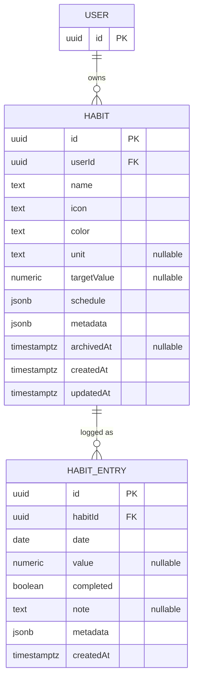
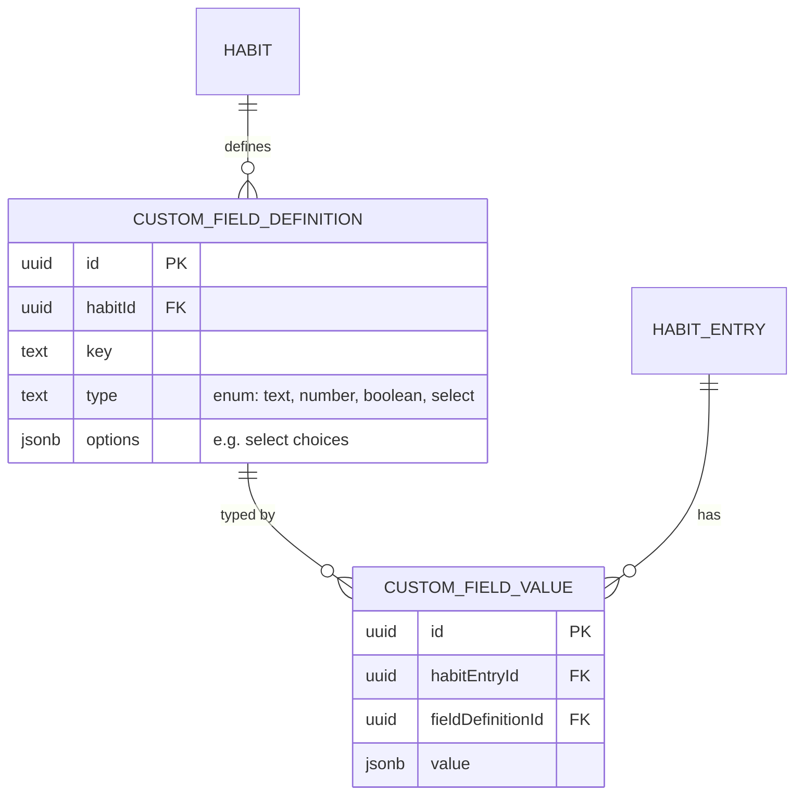

# Habit Data Model

The requirement is "create a custom habit and track all the information of my
habits" — i.e. the habit shape itself should be flexible (not a fixed
"boolean did/didn't" tracker), and each check-in can carry more than a
checkbox.

## ERD



`(habitId, date)` on `HABIT_ENTRY` is a unique constraint, not a separate
relation — see the note below the table.

If custom fields later move from JSONB to the EAV model described below, add:



This second diagram is **not** part of the recommended starting schema — see
"Handling 'custom' fields" below for when it'd actually be worth adding.

## Core entities

**`Habit`** — the definition, created once, edited rarely.

| field          | type                              | notes                                   |
|----------------|-----------------------------------|------------------------------------------|
| `id`           | uuid                               |                                          |
| `userId`       | uuid                               | owner (even single-user apps benefit from this for future auth) |
| `name`         | text                                |                                          |
| `icon`/`color` | text                                | for UI                                  |
| `unit`         | text, nullable                     | e.g. "pages", "minutes", "reps"; null = simple boolean habit |
| `targetValue`  | numeric, nullable                  | e.g. 30 (minutes), 8 (glasses of water) |
| `schedule`     | jsonb                               | see "Schedule" below                    |
| `metadata`     | jsonb                               | freeform custom fields (see below)      |
| `archivedAt`   | timestamptz, nullable              | soft-archive instead of delete          |
| `createdAt`/`updatedAt` | timestamptz               |                                          |

**`HabitEntry`** — one check-in/log for a habit on a given day.

| field        | type                | notes                                          |
|--------------|---------------------|-------------------------------------------------|
| `id`         | uuid                |                                                  |
| `habitId`    | uuid (FK)           |                                                  |
| `date`       | date                | the day this entry belongs to (not `createdAt`) |
| `value`      | numeric, nullable   | actual amount for the day (vs. `targetValue`)   |
| `completed`  | boolean             | derived or explicit, for boolean-style habits   |
| `note`       | text, nullable      | free-text journal for that entry                |
| `metadata`   | jsonb               | freeform per-entry custom data                  |
| `createdAt`  | timestamptz         |                                                  |

Unique constraint on `(habitId, date)` — one entry per habit per day (adjust
if a habit can be logged multiple times/day, e.g. water glasses as separate
rows instead of a summed `value`).

## Beyond the basics: avoid habits, time boxes, freezes, challenges, routines, points

| What | Where | How it's read |
| ---- | ----- | ------------- |
| **Avoid habits** ("no sugar") | `Habit.polarity` = `avoid` | A due day counts as done unless an entry records a slip (not completed, `value` > 0 = slips that day; 0 undoes it). `polarity.util.ts` turns the slips into the check-ins a build habit would have, so streaks, points, heatmaps and insights need no special cases. A slip today breaks the streak at once |
| **Time-boxed habits** | `Habit.endDate` | Days after it aren't due (they join the not-due ranges below), and the habit archives itself once it has passed (`HabitsService.archiveEnded`, run before listing habits) |
| **Streak freezes** | `StreakFreeze(habitId, date)` | A missed day from the last 7, bought back for 50 points; it's a one-day not-due range, exactly like a pause |
| **Challenges** | `HabitChallenge(habitId, startDate, endDate, target, multiplier)` | Met (target check-ins in the range), its check-ins earn (multiplier − 1) × 10 extra points, in the habit's points and the wallet (`challenge.util.ts`). One at a time per habit, 31 days at most |
| **Routines** | `Routine` + `RoutineHabit(routineId, habitId, position)` | Ordered habits done together; a habit is in one routine at most (`habitId` is unique) |
| **Points wallet** | `Reward`, `PointsSpend` | Earned = 10 per check-in ever (archived habits too) + challenge bonuses, derived; spent = the ledger (rewards redeemed, freezes); balance = earned − spent. Separate from the level, which stays on the 120-day window, so spending never lowers it |
| **Custom fields** | `Habit.metadata.fields: [{ label, type, value, options? }]` | The JSONB option below, typed, edited in the habit dialogs; see "Typed fields" below |

**Not-due ranges.** `HabitsService.pausesFor` returns, per habit, its pause
stretches, each frozen day, and everything after a time-boxed habit's end,
as one list of ranges. Every rule that asks "was this day due?" (streaks,
misses, insights) uses it, so the three behave the same way.

**Per-day status.** `day-status.util.ts` names how a habit went on a day:
DONE, PARTIAL, SLIPPED, MISSED, DUE (today or later, not done yet), FROZEN,
PAUSED, OFF (not due) or NONE (outside tracking). The heatmap, the
week/month calendar, the weekly review, achievements and correlations all
read it, through `HabitHistoryService`, which loads a set of habits with
their entries, not-due ranges, freezes and challenges once.

**Today is pending.** The current streak doesn't break on today while it
isn't done yet: it counts today once done, and otherwise counts back from
yesterday (a slip on an avoid habit is the exception). Records and insights
already treated today this way.

## Handling "custom" fields: JSONB vs. EAV

Two ways to let users attach arbitrary extra info to a habit or entry:

1. **JSONB `metadata` column (recommended to start).** Store
   arbitrary key/value pairs directly on `Habit`/`HabitEntry`. Simple, no
   extra tables, Postgres indexes JSONB fine (`GIN` index) if you need to
   query by a custom field later. Downside: no schema/type safety on the
   custom fields themselves — validate shape in the NestJS DTO layer.
2. **EAV model** (`CustomFieldDefinition` + `CustomFieldValue` tables) — lets
   users define typed custom fields (e.g. "mood: enum[great,ok,bad]") that
   show up as real form inputs. More correct for a "field builder" UI, but
   meaningfully more backend/frontend complexity (dynamic form rendering,
   per-type validation, migrations-free schema evolution).

Start with (1). It satisfies "track all the information" for a personal
tool immediately; migrate specific popular custom fields into first-class
columns as patterns emerge, and only build (2) if you actually want a
user-facing "add a custom field" builder UI.

### Typed fields (built)

The field builder uses option (1) with a type on each field, since the
values belong to the habit ("Coach: Sam", "Outdoor: yes"), not to each
check-in:

```json
{ "fields": [
  { "label": "Coach", "type": "text", "value": "Sam" },
  { "label": "Budget", "type": "number", "value": "40" },
  { "label": "Outdoor", "type": "boolean", "value": "true" },
  { "label": "Gear", "type": "select", "value": "road", "options": ["road", "trail"] },
  { "label": "Race day", "type": "date", "value": "2026-11-15" }
] }
```

`value` is always a string, "" when not filled in, so a field saved before
types existed (no `type`) reads as text. `customFieldSchema`
(`habits/dto/create-habit.dto.ts`) checks each value against its type, keeps
`options` only on a select (de-duplicated) and requires at least one. GraphQL
exposes `type` as the `HabitFieldType` enum and `options` as `[]` for the
other types. The web form (`HabitExtraFields`) shows a matching input per
type and won't save a row whose value doesn't fit (`fieldIssue` in
`lib/habit-draft.ts`). Changing a field's type keeps a value that still fits.
Values per check-in would still need option (2).

## Derived data (computed, not stored)

Streaks, completion rate, and "due today" are computed from `Habit.schedule`
+ `HabitEntry` rows, not stored as columns — storing them invites drift.
Compute in the GraphQL resolver/service layer (see
[graphql-bff.md](../backend/graphql-bff.md)) or as a Postgres view if it
becomes a performance concern.

## Schedule shape (habit frequency)

Store as JSONB so "every day", "3x/week", "specific weekdays", and "every N
days" are all representable without a schema migration per new pattern:

```json
// every day
{ "type": "daily" }

// specific weekdays
{ "type": "weekly", "daysOfWeek": [1, 3, 5] }

// N times per week, any days
{ "type": "timesPerWeek", "count": 3 }

// every N days
{ "type": "interval", "everyNDays": 2 }
```
