# Knowledge Graph

A bird's-eye map of how the pieces documented across `docs/` connect: domain
entities → use-case groups ([use-cases.md](use-cases.md)) → the backend code
that implements them → the frontend that surfaces them. Use it to find "if I
want to touch X, what else is involved" before diving into a specific doc.

```mermaid
graph TD
    subgraph Domain["Domain model — habit-data-model.md · journal.md · todos.md"]
        Habit["Habit<br/>description · tags · schedule"]
        Entry["HabitEntry"]
        Pause["HabitPause<br/>start · resume day"]
        Habit -->|has many| Entry
        Habit -->|has many| Pause
        Journal["JournalEntry<br/>ACTION · FEELING · EVENT"]
        Journal -->|triggered by an EVENT| Journal
        List["TodoList<br/>prefix · nextNumber"]
        Task["Task<br/>number · status · plannedFor · dueOn"]
        Column["TodoColumn<br/>name · status · position"]
        Dep["TaskDependency"]
        List -->|has many| Column
        Column -->|holds| Task
        List -->|has many| Task
        Task -->|waits for, any list| Dep
    end

    subgraph UseCases["Use-case groups — use-cases.md"]
        Manage["Habit management<br/>create · edit · tags · pause · templates"]
        Track["Daily tracking<br/>check-in · value · note"]
        Dash["Dashboard & gamification<br/>streaks · points · level · heatmap"]
        Cal["Calendar<br/>day timeline by startTime"]
        Hist["History & review<br/>30-day grid · records + misses"]
        Insight["Insights<br/>weekday pattern · month trend · week vs week"]
        JournalUC["Journaling & mood<br/>did · felt · happened · calendar · mood score"]
        TodoUC["To-do lists<br/>today · earlier · keys · board · dependencies"]
    end

    subgraph Backend["Backend — graphql-bff.md, nestjs-structure.md, prisma-and-data-access.md"]
        GQL["apps/bff: GraphQL resolvers + DataLoaders<br/>graphql/habits · dashboard · journal · todos"]
        REST["apps/api: REST controllers<br/>/habits · /habit-entries · /dashboard · /journal-entries · /todo-lists · /tasks"]
        Services["HabitsService / HabitEntriesService / HabitStatsService"]
        Records["HabitRecordsService<br/>records (paged) · insights"]
        HabitUtils["streak · gamification · pause<br/>habit-records · habit-insights utils"]
        JournalSvc["JournalService"]
        TodosSvc["TodosService<br/>keys · moves · cycles · search"]
        Prisma["Prisma / Postgres"]
    end

    subgraph Frontend["Frontend — app-shell.md"]
        Card["HabitCard · HabitsDashboard<br/>CreateHabitDialog · EditHabitDialog"]
        DayCal["DayCalendar"]
        Header["StatTiles + sidebar LevelCard"]
        HistoryUI["HabitHistory (30 days)"]
        Detail["HabitDetail<br/>HabitRecordsTable · HabitInsights · WeekComparisonChart"]
        JournalUI["JournalView · JournalCalendar · MoodChart"]
        TodoUI["TodayView · ListsView · BoardView<br/>TaskDialog · TaskPicker · ConfirmPrompt"]
    end

    Manage --> Habit
    Manage --> Pause
    Track --> Entry
    Dash --> Entry
    Cal --> Habit
    Hist --> Entry
    Insight --> Entry
    JournalUC --> Journal
    TodoUC --> Task
    TodoUC --> List
    TodoUC --> Dep

    Manage --> Services
    Track --> Services
    Dash --> Services
    Cal --> Services
    Hist --> Records
    Insight --> Records
    Services --> HabitUtils
    Records --> HabitUtils
    JournalUC --> JournalSvc
    TodoUC --> TodosSvc
    Services --> Prisma
    Records --> Prisma
    JournalSvc --> Prisma
    TodosSvc --> Prisma
    GQL -->|HTTP| REST
    REST --> Services
    REST --> Records
    REST --> JournalSvc
    REST --> TodosSvc

    Manage --> Card
    Track --> Card
    Dash --> Header
    Cal --> DayCal
    Hist --> HistoryUI
    Hist --> Detail
    Insight --> Detail
    JournalUC --> JournalUI
    TodoUC --> TodoUI

    Card --> GQL
    DayCal --> GQL
    Header --> GQL
    HistoryUI --> GQL
    Detail --> GQL
    JournalUI --> GQL
    TodoUI --> GQL
```

## How to read it

- **Domain → Use cases**: which entity a use-case group mainly reads or
  writes. Dashboard, History and Insights all center on `HabitEntry`,
  because streaks, points, heatmaps, misses and rates are *derived from*
  entries, never stored (see "Derived data" in the data model doc).
- **Pauses cut across habits.** `HabitPause` days count as not due, so they
  change streaks (`streak.util.ts`), misses (`habit-records.util.ts`) and
  rates (`habit-insights.util.ts`) at once. A change to how pauses work
  touches all three.
- **Use cases → Backend**: habit groups go through the API's
  `HabitsService` / `HabitEntriesService` / `HabitStatsService`, and the
  detail page's records and insights through `HabitRecordsService`, which
  works out misses and rates on the server so the browser only gets one page
  of records. The BFF reaches all of them over REST; it only changes when the
  GraphQL shape does.
- **Use cases → Frontend**: Dashboard spans `StatTiles`, the sidebar's level
  card and `HabitCard`, so a change to the points/level formula
  (`gamification.util.ts`) shows in all three. History spans the 30-day
  grid and the habit detail page.
- **Journaling is its own island.** `JournalEntry` has no relation to
  `Habit`. Its only link is to itself (a feeling or action → the event that
  triggered it). The mood score is computed in the browser from feelings
  (`lib/mood.ts`), see [journal.md](journal.md).
- **To-do lists are another island.** `TodoList` / `TodoColumn` / `Task` /
  `TaskDependency` don't touch habits or the journal. A task's status
  always follows its column's. Dependencies cross
  lists; keys are derived from the list's current prefix, so a prefix
  rename touches one row. See [todos.md](todos.md).

## Finance module

Finance ([finance/index.md](../finance/index.md)) is a parallel subgraph:
`Account → Transaction ← Category` (a split transaction has
`TransactionSplit` parts, each with its own category), `Category → Category`
(one level of nesting), `Budget → Category`, `PayeeRule → Category`,
`SavingsGoal → Account`, subscriptions and quick log, served by `FinanceModule` REST controllers in `apps/api` and
`graphql/finance/` in `apps/bff`. Its edges into the habits graph are
listed in [finance/habits-integration.md](../finance/habits-integration.md)
and run one way: finance writes `HabitEntry` rows through
`HabitEntriesService` (`FinanceHabitsService`, for the no-spend day and
log-today habits), and habits never import finance. It's kept out of the
diagram above.

Regenerate this diagram (by hand: it's illustrative, not derived from code)
whenever a use case moves to a different service/component, or a new
use-case group is added to use-cases.md.
